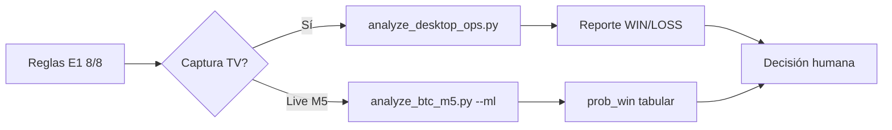
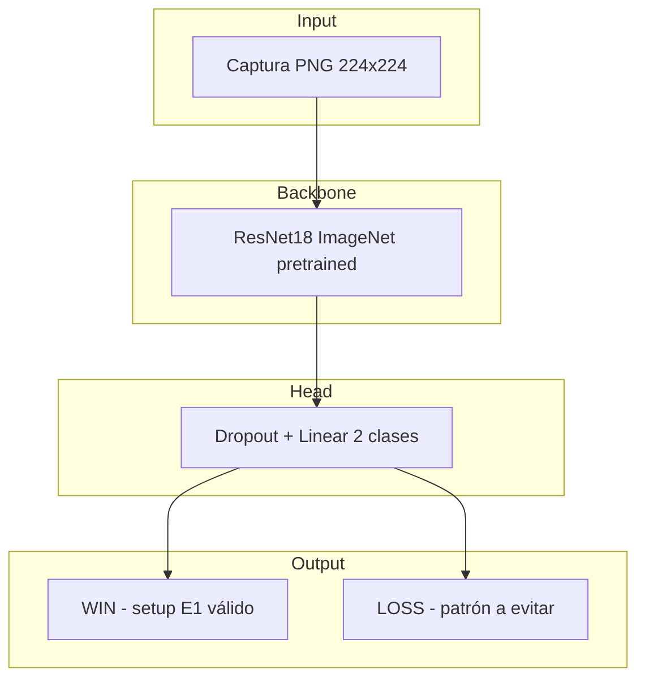

# Estrategia neuronal — Visión desktop E1

> Cómo el deep learning complementa el plan operativo E1 usando la galería real de capturas TradingView.

---

## 1. Propósito

El módulo `training neuronal/` entrena un clasificador visual que distingue:

- **WIN** — setup alineado con patrones ganadores de la galería (§5.1)
- **LOSS** — setup con errores típicos documentados (§5.2)

No reemplaza las **8 reglas inmutables** ni la validación manual en TradingView. Aporta una segunda opinión **basada en screenshots históricos** cuando comparas una captura nueva contra la galería.

---

## 2. Complemento al ML tabular (`train_btc_signals.py`)

| Aspecto | ML tabular (`btc_ml_signals.py`) | ML visión (este módulo) |
|---------|----------------------------------|-------------------------|
| **Entrada** | Features numéricas (RSI, bias H1, zona, reglas E1) | Píxeles de captura desktop |
| **Momento** | Análisis **live** M5 (Binance) | Revisión **post-trade** o pre-validación visual |
| **Pregunta** | ¿Este setup M5 histórico ganó TP 1:2? | ¿Esta captura se parece a WIN o LOSS de la galería? |
| **Salida** | `prob_win`, grade A+/B/C | WIN/LOSS + confianza + reporte markdown |

### Flujo integrado

---

## 3. Patrones visuales E1 (galería desktop)

Extraídos de `docs/strategy/TRADING_OPERATIONS_DESKTOP_CONTEXT.md` §5.1 y §2.2:

| Elemento visual | Rol E1 |
|-----------------|--------|
| **Zonas moradas** | S/R débiles — única zona válida |
| **Líneas 1H / 4H** | Contexto HTF; entrada cerca |
| **2 velas M5** | Confirmación direccional |
| **Widget Bias** | Daily/Weekly alineado con el trade |
| **Oscilador D/H** | Divergencia en extremos |
| **Herramienta Long/Short** | SL rojo, TP verde, R:R ~1:2 |
| **CRT** | Continuaciones ocasionales |

### Patrones WIN (entrenamiento positivo)

- Sweep + reclaim + 2 velas verdes
- Breakout + retest en zona morada
- Rechazo en máximo de sesión (short)
- Reacción 1H/4H + volumen (POC/HVN)
- Bias widget alineado

### Patrones LOSS (entrenamiento negativo)

- Long con Daily/Weekly BEARISH
- Cuchillo cayendo sin confirmación
- Soporte roto con momentum
- Fakeout / retest fallido
- 3.er/4.º trade en día rojo

---

## 4. Arquitectura del modelo

**Fallback `--simple`:** RandomForest sobre histogramas RGB + ratio morado/verde/rojo (sin GPU, sin torch).

---

## 5. Enlace al plan E1 (8 reglas inmutables)

| Regla | Cómo la usa el modelo visual |
|-------|------------------------------|
| Solo E1 | Aprende de ~95% capturas E1; E2 (`BTC-18-07-26`) es excepción |
| Sesión NY | Wins concentrados 08:00–11:00 en galería |
| SL ~$9 | No visible en píxeles; regla de cuenta |
| R:R ≥ 1:2 | Caja verde ≥ 2× roja en herramienta TV |
| Máx. 3 ops/día | Archivos `BTC-3-*`, `BTC-4-*` en días rojos = LOSS |
| 2 SL = fin | Secuencias LOSS mismo día en entrenamiento |
| BE en 1:1 | No siempre visible |
| Rules >70% | Wins alinean bias + zona + NY |

Consultar siempre `docs/strategy/TRADING_VISUAL_CONTEXT.md` y `docs/strategy/TRADING_STRATEGY_CONTEXT.md` antes de operar.

---

## 6. Limitaciones

- Aprende de **screenshots**, no de precio en vivo.
- No detecta texto del widget Bias con OCR (futuro: capa multimodal).
- 112 capturas ≈ dataset pequeño → usar como **asistente**, no oráculo.
- Re-entrenar al añadir capturas nuevas.

---

*Ver también: `TRADING_NEURAL_TRAINING.md`, `TRADING_NEURAL_DESKTOP_ANALYSIS.md`*
